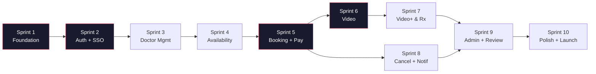

# ChekUp247 — Sprint Roadmap & Overview

**Sprint duration:** 2 weeks each  
**Total sprints:** 10 (20 weeks for MVP)  
**Methodology:** Agile with 2-week sprints  
**Estimation unit:** Fibonacci story points (1, 2, 3, 5, 8, 13)

---

## 1. Sprint Schedule & Roadmap

| Sprint | Focus | Points | Duration | File Link |
|---|---|---|---|---|
| **Sprint 1** | Foundation & Project Scaffolding | ~60 | Weeks 1–2 | [sprint-01-foundation-scaffolding.md](file:///c:/chekup247/docs/sprints/sprint-01-foundation-scaffolding.md) |
| **Sprint 2** | Authentication & LocumStaff SSO | ~57 | Weeks 3–4 | [sprint-02-auth-locumstaff-sso.md](file:///c:/chekup247/docs/sprints/sprint-02-auth-locumstaff-sso.md) |
| **Sprint 3** | Doctor Management & Directory Sync | ~50 | Weeks 5–6 | [sprint-03-doctor-management-directory-sync.md](file:///c:/chekup247/docs/sprints/sprint-03-doctor-management-directory-sync.md) |
| **Sprint 4** | Availability & Calendar System | ~46 | Weeks 7–8 | [sprint-04-availability-calendar.md](file:///c:/chekup247/docs/sprints/sprint-04-availability-calendar.md) |
| **Sprint 5** | Booking & Payments (Split-DB Saga) | ~70 ⚠️ | Weeks 9–10 | [sprint-05-booking-payments.md](file:///c:/chekup247/docs/sprints/sprint-05-booking-payments.md) |
| **Sprint 6** | Video Consultation (Daily.co Core) | ~58 | Weeks 11–12 | [sprint-06-video-consultation-core.md](file:///c:/chekup247/docs/sprints/sprint-06-video-consultation-core.md) |
| **Sprint 7** | Time Extensions & E-Prescriptions | ~65 | Weeks 13–14 | [sprint-07-time-extensions-e-prescription.md](file:///c:/chekup247/docs/sprints/sprint-07-time-extensions-e-prescription.md) |
| **Sprint 8** | Cancellation, Notifications & Reminders | ~70 ⚠️ | Weeks 15–16 | [sprint-08-cancellation-notifications-reminders.md](file:///c:/chekup247/docs/sprints/sprint-08-cancellation-notifications-reminders.md) |
| **Sprint 9** | Admin Dashboard, Reviews & Doctor Earnings | ~82 ⚠️ | Weeks 17–18 | [sprint-09-admin-reviews-earnings.md](file:///c:/chekup247/docs/sprints/sprint-09-admin-reviews-earnings.md) |
| **Sprint 10** | Public Pages, Polish & Launch Prep | ~78 | Weeks 19–20 | [sprint-10-public-pages-polish-launch.md](file:///c:/chekup247/docs/sprints/sprint-10-public-pages-polish-launch.md) |
| **Total** | **MVP Scope** | **~636** | **20 weeks** | |

---

## 2. Sprint Dependency Map



---

## 3. Parallel Work Streams

When executing with a cross-functional team, the work streams operate in parallel:

```
Stream A (Backend-heavy):  Sprint 1 → 2 → 5 → 6 → 7
Stream B (Frontend-heavy): Sprint 1 → 3 → 4 → 8 → 10
Stream C (Admin / Ops):    Sprint 1 → 2 → 3 → 9
```

### Recommended Team Allocation
- **Backend Developer 1:** API core, auth, OIDC SSO, booking saga, Paystack, video backend
- **Backend Developer 2:** Notifications, background workers (BullMQ), directory sync, prescription PDF generation, admin APIs
- **Frontend Developer 1:** Patient App — public pages, search, booking flow, video consultation interface
- **Frontend Developer 2:** Doctor Portal — calendar, consultation workspace, prescription builder
- **Frontend Developer 3:** Admin Panel — doctor verification queue, transaction ledger, analytics, dispute resolution
- **Product Designer:** Design tokens, component library, video overlays, responsive states, email/PDF templates

---

## 4. Critical Path Items

These milestones cannot be parallelized and dictate the delivery timeline:
1. **Sprint 1 (Foundation):** Blocks all backend and frontend feature code.
2. **Sprint 2 (Auth & RBAC):** Blocks all authenticated operations across all 3 apps.
3. **Sprint 5 (Booking Saga & Split-DB Transactions):** Blocks payments, video rooms, and prescriptions.
4. **Sprint 6 (Video Core):** Blocks time extension and in-call workflows.

---

## 5. External Dependencies Checklist

| Dependency | Required By | Action Required | Status |
|---|---|---|---|
| LocumStaff OIDC Client Registration | Sprint 2 | Register `client_id`, `client_secret`, `redirect_uri`, `directory_api_key` in LocumStaff Admin | Pending |
| LocumStaff `willingToDoVirtualConsultations` Flag | Sprint 3 | Request one-line check in `authorize()` and `token()` from LocumStaff team | Pending |
| Paystack Account & API Keys | Sprint 5 | Configure test and live keys, webhook endpoints, tokenized recurring billing | Pending |
| Daily.co Account & API Key | Sprint 6 | API key ready; verify room configuration & custom branding options | Ready |
| Brevo Account & API Keys | Sprint 8 | Set up transactional email templates, verify sending domain | Pending |
| SMS Gateway Provider Selection | Sprint 8 | Evaluate local South African gateway vs Twilio (cost and delivery reliability) | Decision needed |
| WhatsApp Business API Approval | Sprint 8 | Submit business verification and reminder templates to Meta (leads by 2–4 weeks) | Early action required |
| MediKredit NAPPI Database License | Sprint 7 | Secure commercial data agreement; fall back to free-text entry if delayed | In progress |
| Legal Privacy Policy & Terms of Service | Sprint 10 | Draft POPIA-compliant documentation and telehealth consent agreements | Pending |
